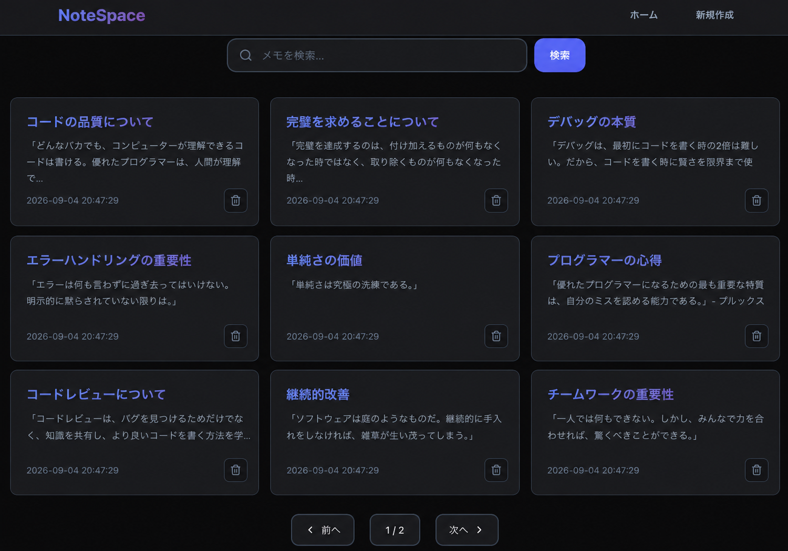
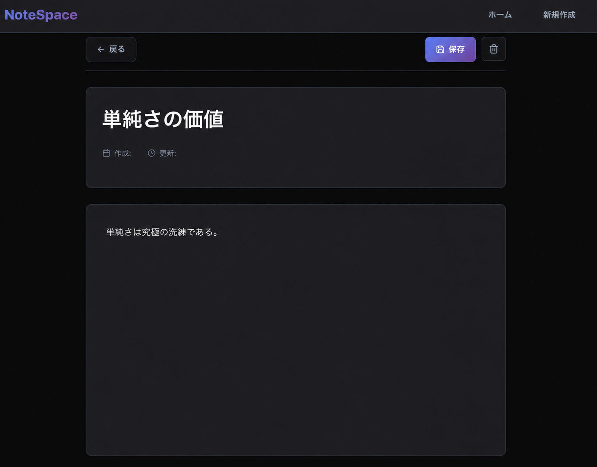
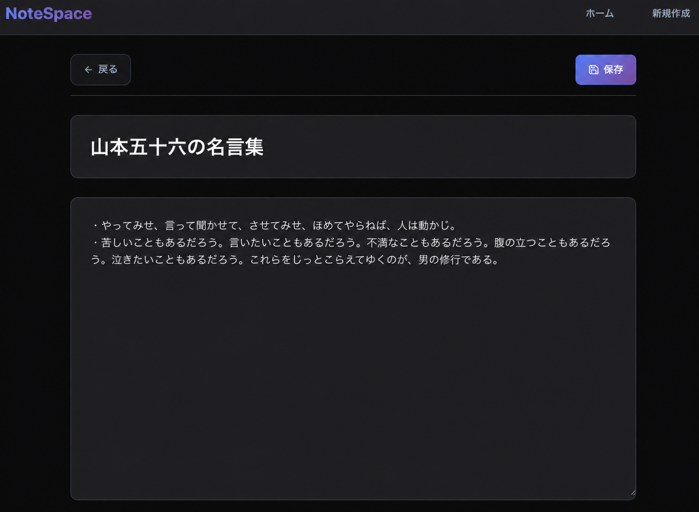

# NoteSpace

学習メモを記録・整理するために作成した、React + Vite のメモアプリです。

## 機能

### 一覧画面

メモをカード形式で一覧表示し、検索・ページ移動・削除ができます。



### 詳細画面

メモのタイトルと本文を確認・編集し、保存または削除できます。



### 新規作成画面

タイトルと本文を入力して、新しいメモを保存できます。



## 起動方法

```bash
npm install
npm run dev
```

表示されたローカルURLをブラウザで開きます。メモ一覧・保存機能には、`http://localhost:3001` でAPIサーバーを起動してください。
